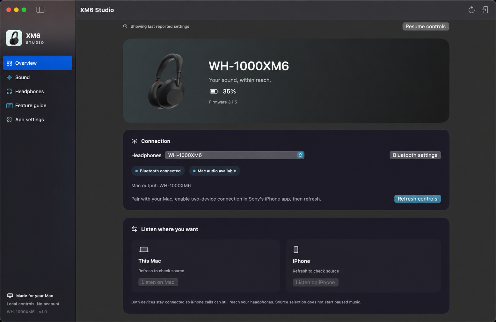
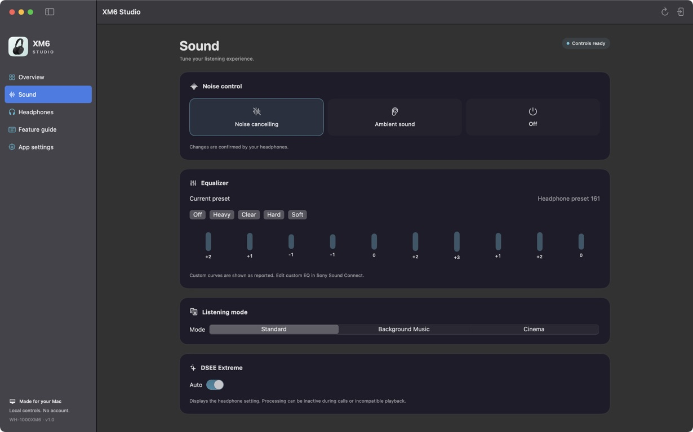
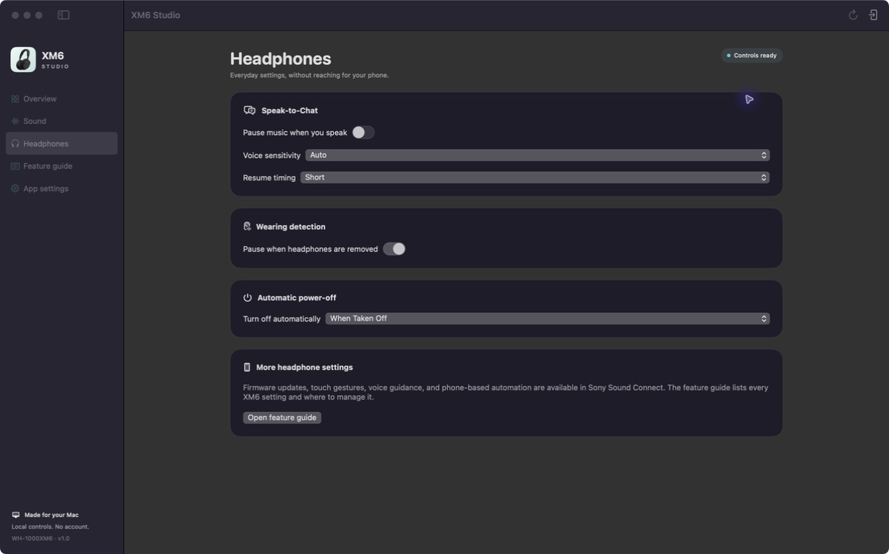

# XM6 Studio

Control your **Sony WH-1000XM6** headphones from your Mac. Change sound settings, check battery and connection status, and choose when to switch playback between your Mac and iPhone.

A native macOS app with a settings window and menu bar controls. Works locally, without an account or analytics. Independent software, not affiliated with Sony.

**You do not need to know how to code.** A ready-to-install app and step-by-step instructions are included in the download.

## Download and start

### [Download XM6 Studio 1.0.1 for Apple Silicon](https://github.com/IamShaharFar/xm6-studio/raw/refs/heads/main/downloads/XM6-Studio-1.0.1-Apple-Silicon.zip)

**Requirements:** a Mac with Apple Silicon (M1 or later), macOS 15 or later, and Sony **WH-1000XM6** headphones. This build does not support Intel Macs or other headphone models.

1. Download and unzip the file. Drag **XM6 Studio.app** to **Applications**.
2. Pair and connect your headphones in **System Settings → Bluetooth**.
3. Open XM6 Studio and allow Bluetooth access when macOS asks.
4. Click **Refresh controls** and wait for **Controls ready**.
5. For Mac/iPhone switching, enable **Connect to 2 devices simultaneously** in Sony Sound Connect on your iPhone and connect both devices.

### First launch: “XM6 Studio” Not Opened

This version is locally signed, without Apple Developer ID signing or notarization. macOS can therefore show a warning that Apple could not verify the app.

If you trust this download:

1. Click **Done** to dismiss the warning.
2. Move the app to **Applications**, then try opening it there once.
3. Open **System Settings → Privacy & Security**, scroll to **Security**, and click **Open Anyway** for XM6 Studio.
4. Confirm **Open** and authenticate with your Mac if requested.

This creates an exception for this app. Do not disable Gatekeeper globally. Managed Macs may restrict this option. See [Apple's instructions](https://support.apple.com/en-gb/102445) and the [full installation guide](START%20HERE.txt).

[Full installation and troubleshooting guide](START%20HERE.txt) · [Download details and SHA-256 checksum](downloads/README.md)

## The app



The Overview image was edited from an actual screenshot for presentation, removing personal device names and desktop elements. It retains the displayed cached-state labels and disabled controls.





The Sound and Headphones images are unedited screenshots of the running app with reported headphone settings. A [Hebrew social cover](docs/images/social-cover-he.png) is also available; see [image notes](docs/images/README.md).

## What you can do

| Area | Controls |
| --- | --- |
| Playback source | **Listen on Mac** / **Listen on iPhone**. The Mac action also selects the headphones as the Mac's audio output. |
| Noise control | Noise cancellation, ambient sound, ambient level and voice focus. |
| Sound | EQ presets, a read-only custom EQ curve, Standard / Background Music / Cinema modes, BGM room size and DSEE Extreme. |
| Headphones | Speak-to-Chat and its configuration, wearing detection and automatic power-off. |
| Status | Battery, firmware, connected sources, and separate indicators for audio and control availability. |
| Everyday use | Menu bar controls, optional launch at login, and local diagnostics with redacted exports. |

Firmware updates, custom EQ editing, touch/voice setup, phone automation and some other features remain in Sony Sound Connect. The [feature guide](Feature%20Coverage.md) accounts for all 43 entries in Sony's XM6 app feature list.

## Switching and connection behavior

- Both devices stay connected. Switching is initiated by you; the app does not continuously force playback back to the Mac or disconnect the iPhone.
- A change is shown as confirmed only after the headphones report the requested state. A Bluetooth acknowledgement alone is not enough. Confirmation does not measure audible playback.
- Source selection does not start paused music. Start playback in the chosen device's media app if needed.
- Existing settings are read when connecting, not overwritten. Unavailable settings stay disabled.
- The control channel closes after 30 seconds of inactivity. Cached values are labeled. Click **Refresh controls** to read the current settings again.
- Use **Release controls for Sony app** before opening Sony Sound Connect. This releases settings control while leaving Bluetooth audio connected.
- The app makes one bounded recovery attempt. It does not replay a write whose outcome is uncertain or disconnect audio to repair controls.

If the Mac or iPhone is not recognized automatically, assign them in **Overview → Device identities**. Closing the main window keeps the menu bar app running; use **Command-Q** to quit.

## What has been tested

Tested on one Apple Silicon Mac with macOS 15.7.5 and WH-1000XM6 firmware 3.1.5:

- **21 automated tests passed**, covering framing, malformed responses, read-only startup, confirmation, timeouts, stale state and recovery.
- **Ten alternating Mac/iPhone source switches** were confirmed by the headphones, with both devices remaining connected.
- Several sound and headphone settings were changed, confirmed and restored.

Incoming calls, notification interruptions, sleep/wake, Sony-app coexistence and compatibility on additional Macs still need testing. This app cannot guarantee uninterrupted playback or prevent every firmware-driven switch. See the [verification report](Verification.md) for the exact scope.

## Feedback is welcome

**You do not need to be technical to help improve this app.** Tell us what was confusing, what did not work, or what you wish it could do. “I could not figure out how to switch to my iPhone” is useful feedback too.

[Share feedback or report a problem](https://github.com/IamShaharFar/xm6-studio/issues/new?template=feedback.md)

For connection problems, your Mac model, macOS version, headphone firmware and a short description of what happened help us investigate. Remove personal device names from screenshots. The app can export a redacted diagnostic report if needed.

## Build from source

Only developers need this section. The download above is ready to install.

Requirements: Apple Silicon Mac, macOS 15+, and Xcode Command Line Tools with Swift 6.0 or newer. Protocol code is vendored at pinned revisions, so the build has no third-party package downloads.

```sh
git clone https://github.com/IamShaharFar/xm6-studio.git
cd xm6-studio
./Scripts/test.sh
./Scripts/build.sh
open "dist/XM6 Studio.app"
```

`build.sh` accepts an optional destination folder and produces a locally signed app and ZIP. The Swift package separates `XM6Core` (protocol and state) from `XM6Companion` (IOBluetooth, Core Audio and SwiftUI). Internal target and bundle identifiers retain the original name so existing preferences continue to work.

The app stores headphone choices locally. It has no servers, telemetry, audio recording or automatic network fetches. Diagnostics are bounded in memory and exported only on request.

## Project story and attribution

Built with **Astra 6 in Codex** from a detailed initial prompt that did most of the implementation, followed by design refinements and validation on real headphones. The project started with an everyday frustration: managing headphone settings on the phone while working on the Mac.

Protocol work builds on [xm6-control](https://github.com/ruimartins23/xm6-control) and [SonyHeadphonesClient](https://github.com/mos9527/SonyHeadphonesClient). Their pinned revisions, MIT notices and the Sony product-photo attribution are preserved in [THIRD_PARTY.md](THIRD_PARTY.md) and [ThirdParty/](ThirdParty/). Sony's photograph and trademarks remain separate from the MIT-licensed protocol components.
